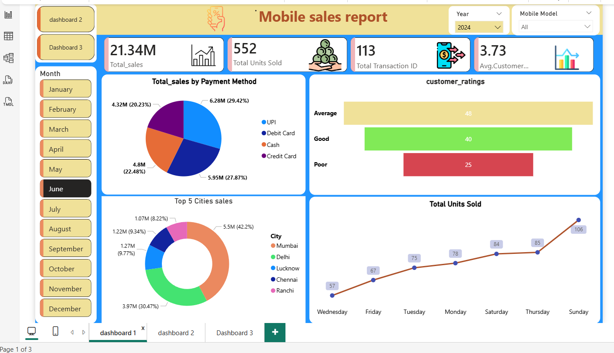

# 📊 Mobile Sales Dashboard (Power BI)

## 🚀 Overview  
Interactive Power BI dashboard to analyze mobile sales performance, customer behaviors, and payment trends using dynamic visualizations and KPIs to take better decision for business growth.

---

## 📌 Key KPIs  
- 💰 Total Sales  
- 📦 Total Units Sold  
- 🧾 Total Transactions  
- ⭐ Average Customer Ratings  

---

## 📊 Key Insights  
- Top 5 Cities contribution (percentage & revenue in millions)  
- Sales by Payment Method (UPI, Cash, Credit, Debit)  
- Weekly Sales Trend (Day-wise performance)  
- Customer Ratings Analysis (Good, Average, Poor)  

---

## ⚙️ Features  
- Interactive filters (Year & Mobile Brand)  
- Multi-page dashboard (MTD & Sales Comparison)  
- Previous Year vs Current Year analysis  
- Clean and dynamic visuals  

---

## 🛠️ Tools Used  
- Power BI  
- DAX  
- Data Visualization
- Data cleaning (Power Query)

---

## 📸 Dashboard Preview  

---

## 🎯 Objective  
To provide actionable insights for business decision-making through interactive dashboards.
